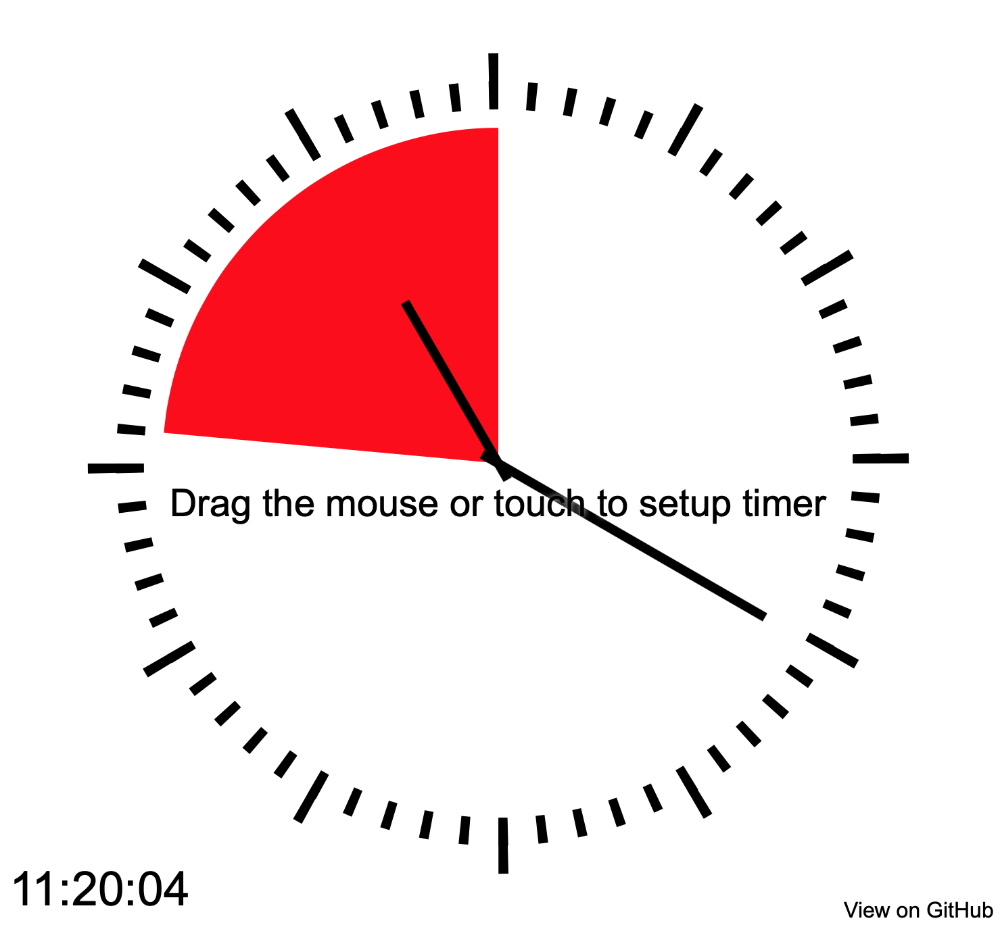

# Agile Timer

All you agile practitioners, you know these nice devices which can be placed on the desk and show the remaining time in the current time box.

Regrettably, whenever you need it, you left it home. And if only, because it is too large to transport in your case.

Now you can use this small application to use it without needing to carry more than you already have - your computer.

[](https://timer.digital-wachsen.de/?duration=20&area-opacity=100)
Click on image to try the timer yourself

## Features

- Rings a bell when time is up
- Runs without internet connection (you need to be connected, when opening it, though)
- Works with both, mouse or touch screen
- Works in all sizes (change your window size, if you like)
- Shows current time with hands and digital (the latter only if window is at least a minimum size)
- Works in the background (you don't need to keep the window in front)
- Shows remaining time either relative to minute hand or up to 12
- Configurable in a lot of aspects (see [configuration section](#configuration))
- No installation needed, runs [just here](https://timer.digital-wachsen.de)
- No fees, no signup, no tracking
- optimized for OBS

## How to use with [OBS](https://obsproject.com/)

With OBS, you can use this timer in your next live stream or video conference. To do so, add the timer as `Browser` Element.
The standard user defined CSS added by OBS will already render the background transparent.
To remove the text elements from the timer, there are two ways to make that happen. Either,
you call the timer with a query parameter `hide-text=1` or, you use a custom style in your
 OBS configuration:

```CSS
html {
  --hide-text: 1;
}
```

Feel free to change additional styles to fit your design.

If you use the timer installed on a web server, you can just use the URL and append the parameter `duration` with the duration in minutes.
For example, `https://timer.digital-wachsen.de/?duration=13` would give you a 13 minutes timer.

Since there is no good way to interact with the timer while embedded in an OBS scene, it makes sense to create an extra scene for the timer and mark the checkbox `Refresh browser when scene becomes active`.
This will let you start the timer by switching the scene.

To speed up the refresh of your timer, it makes sense to reference it as local file from OBS.
In that case you don't have the ability to specify the duration via a URL parameter, but we have a solution for that.

You can specify the duration as custom CSS style!
Add

```CSS
html {
    --duration: 25;
}
```

to your custom CSS and it will obey your wish.

(another way is to specify a _local_ url with the file:-Protocol)

## Configuration

Here is a full custom CSS with all currently available options with their default values:

```CSS
html {
    --radius: 380;              /* clock radius in pixels */
    --spacing: 50;              /* space for red area to outside of clock */
    --tick-width: 10;           /* width of ticks */
    --tick-length: 30;          /* length of ticks */
    --fives-length: 60;         /* length of fives */
    --minute-hand-width: 10;    /* width of minute hand */
    --minute-hand-length: 350;  /* length of minute hand */
    --hour-hand-width: 10;      /* width of hour hand */
    --hour-hand-length: 220;    /* length of hour hand */
    --duration: 20;             /* timer duration in minutes */
    --hide-text: 0;             /* set to 0 or remove completely to show the texts */
    --relative: 1;              /* remaining time is relative to current minute hand position, set to 0 to run to 12 */
    --area-opacity: 50;         /* opacity in percent for red and green areas */
}
```

Each of these options (or all of them) can be set via URL as well like in this example:

https://timer.digital-wachsen.de/?duration=5&hide-text=1

URL options will override css options.
