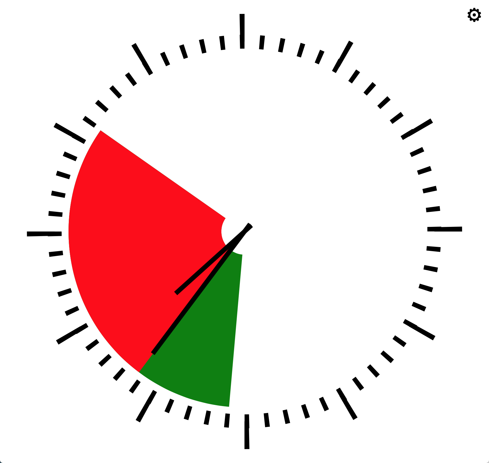

# Simple Timer

All you agile practitioners, you know these nice devices which can be placed on the desk and show the remaining time in the current time box.

Regrettably, whenever you need it, you left it home. And if only, because it is too large to transport in your case.

Now you can use this small application to use it without needing to carry more than you already have - your computer.

## Features

- Rings a bell when time is up
- Runs without internet connection (you need to be connected, when opening it, though)
- Works with both, mouse or touch
- Shows current time with hands and digital (the latter only if window is at least a minimum size)
- Works in the background (you don't need to keep the window in front)
